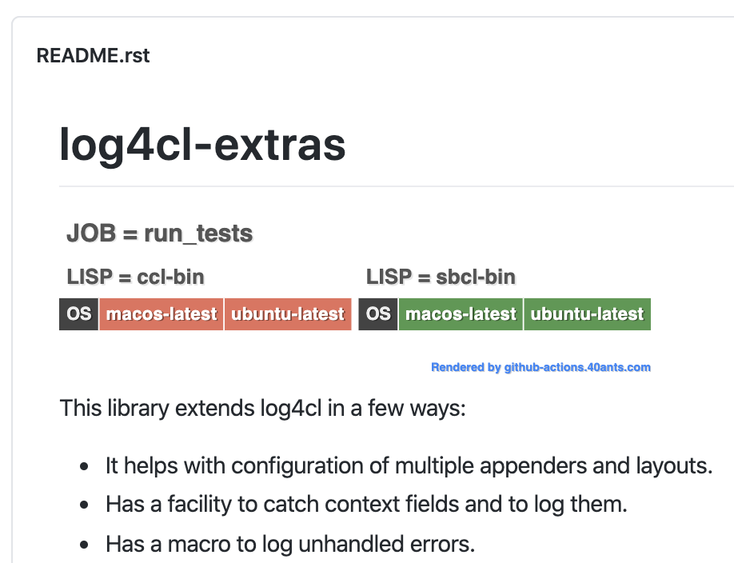
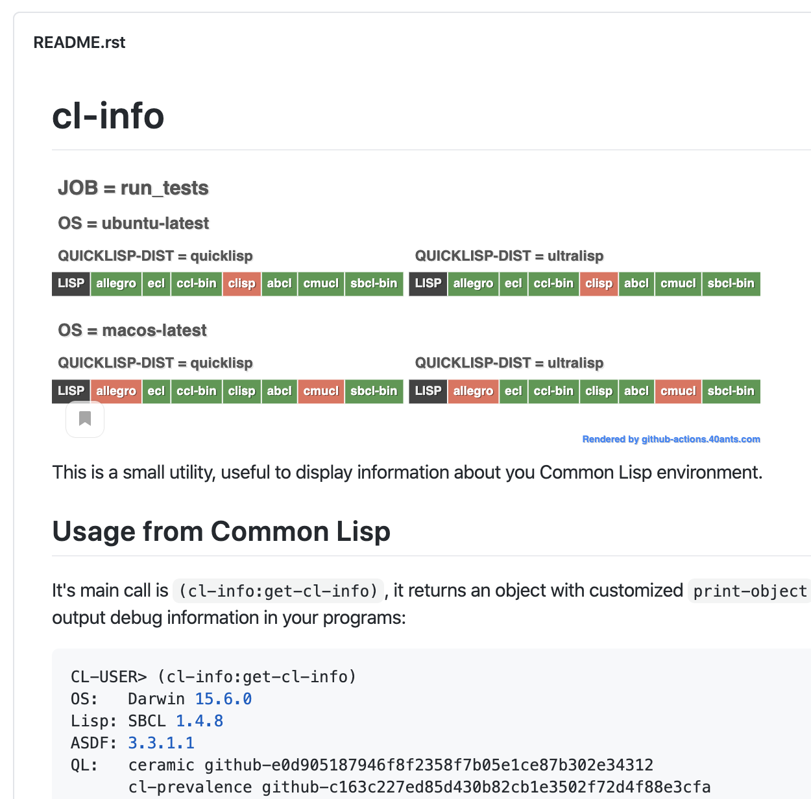

=============
Github Matrix
=============

This project's aim is to give all repositories tested by
Github Actions a way to show the full build status.

Especially it is useful when tests are running under
a "matrix" combinations.

Try it!
=======

Go to the https://github-actions.40ants.com/, enter your library's URL and see get your image!

A Few Previews
==============

Here is an example of the render, when matrix has only two variables: ``os`` and ``lisp implementation``:

.. code::

   matrix:
     lisp:
       - sbcl-bin
       - ccl-bin
     os:
       - ubuntu-latest
       - macos-latest

And this is how more complex matrix is rendered:

.. code::

   matrix:
     os:
       - ubuntu-latest
       - macos-latest
     quicklisp-dist:
       - quicklisp
       - ultralisp
     lisp:
       - sbcl-bin
       - ccl-bin
       - ecl
       - abcl
       - allegro
       - clisp
       - cmucl

How to test locally
===================

::

   (ql:quickload :github-matrix/app)
   
   (github-matrix/app:start 8081 :debug t)

TODO
====

* Support more grid layout for workflows with multiple combinations.
* Let to choose which subset of the matrix to show. This should be interesting
  for projects having multiple jobs.
* Add a special webhook which will be able to add an image into the pull-requests.
  This image should be rendered in a special mode and compare pull's results with results
  of the main branch. Diffrentcies should be hightlighted. This will make visible for which
  matrix combinations a pull request makes fixes/breaks tests.

Known Issues
============

* Badge generator does not work for jobs with custom names like:

  .. code:: yaml

       test:
         name: ${{ matrix.lisp }} on ${{ matrix.os }}
         runs-on: ${{ matrix.os }}
         strategy:
           matrix:
             lisp: [sbcl-bin, ccl-bin]
             os: [ubuntu-latest]

  This is because github's API does not returns a matrix state for a run
  and we have to parse run's name to extract matrix values. Name should
  have this form instead: ``test (sbcl-bin, ubuntu-latest)``.
                    
